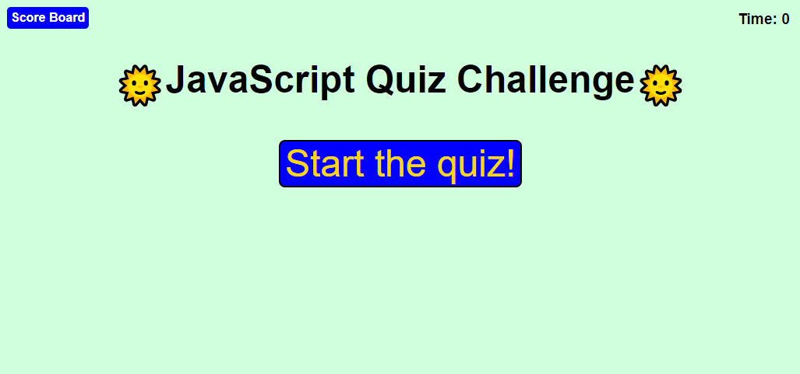
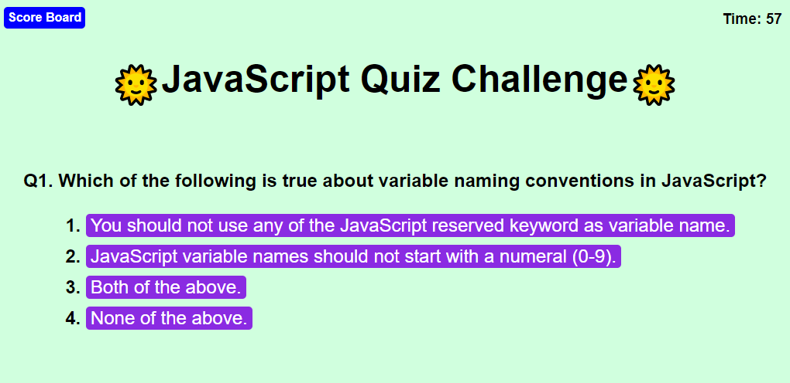
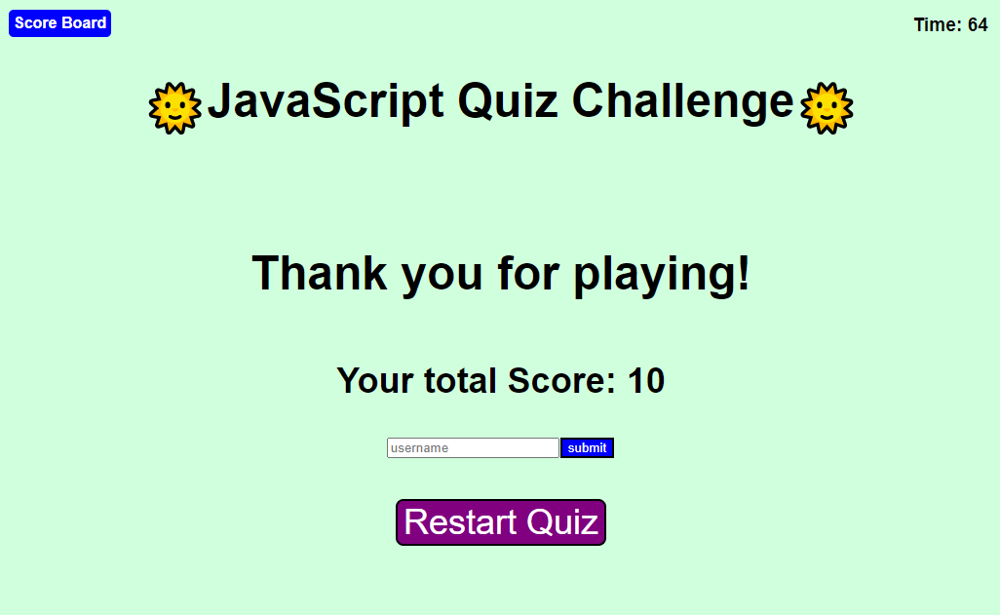
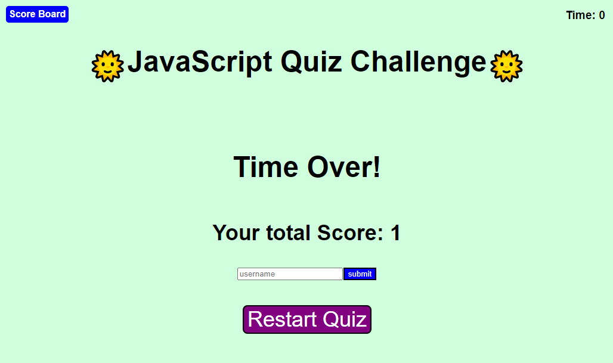
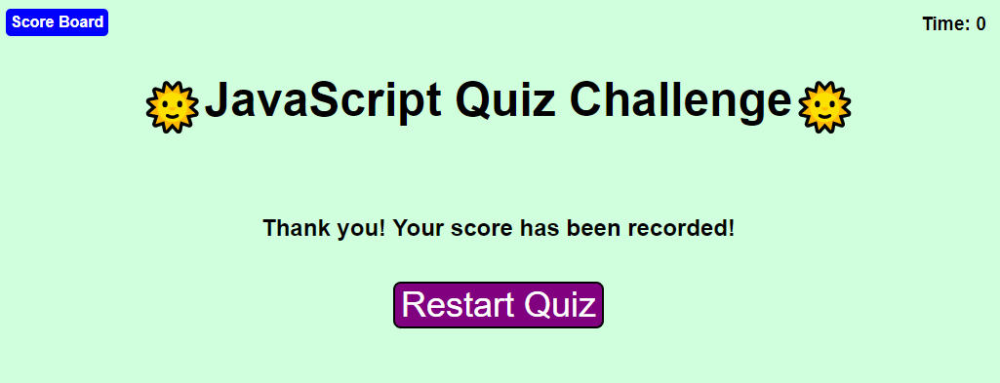
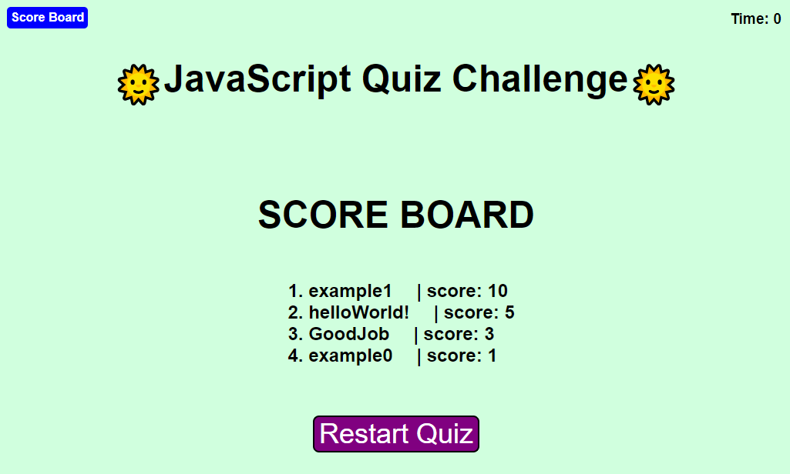

# Trivia Quiz

## Task for Trivia Quiz Project

This Challenge is to build a timed coding quiz with multiple-choice questions. This app will run in the browser and will feature dynamically updated HTML and CSS powered by JavaScript code. It will have a clean, polished, and responsive user interface. 


## User Story

```
AS A a student who wants to study JavaScript
I WANT to take a timed quiz on JavaScript fundamentals that stores high scores
SO THAT I can gauge my progress compared to my peers
```

## Acceptance Criteria

```
GIVEN I am taking a code quiz
WHEN I click the start button
THEN a timer starts and I am presented with a question
WHEN I answer a question
THEN I am presented with another question
WHEN I answer a question incorrectly
THEN time is subtracted from the clock
WHEN all questions are answered or the timer reaches 0
THEN the game is over
WHEN the game is over
THEN I can save my initials and my score
```

## Mock-Up

The following animation demonstrates the application functionality:


## Description
Description of the project including the example images

> * A link to deployed application: https://taeyoungp.github.io/Trivia_Quiz/

The following image demnonstrate the application functionality:


When the page is opened, user can see header title with start game button, option to see score board, and timer indication.
When user start the game, timer will start countdown from 90 seconds, and questions pops up.



When answer is correct, correct message will briefly show on the bottom of question with green color. If answer is incorrect, incorrect message will show up with red color. Then, next question will show after 1 second of correct/incorrect message display.



After finishing the questions, page shows final score and will ask user to submit their username to record the score. User can submit their record, or they can just simply restart the game.



Or if the user couldn't answer all of the question in time, quiz will end with message saying "Time Over!". But user can still submit their record or restart quiz.



Once user name is submitted, user can either view their score on score board or restart the quiz.



Score board will sort the list of players by score value, therefore, the player with the most score is placed at the fisrt place of the score baord.


## How to play
This is Guide for the rule and how to play this quiz:

> * User will be asked with total 10 JavaScript related questions. 

> * If the user gets correct answer, will gain score by 1 point. If the user gets wrong answer, 10 seconds from the timer will be substracted (but there wiil be no point taken from the score). 

> * User will be able to record their score result after finishing all 10 questions in time with their user name. User can still record their score even after timer reaches 0 and gamer over message shows up. Submitting their user name and recording their score is optional, but if the user choose to record their score, they must provide user name that isn't empty. 

> * User can see their recorded user name and score in scoreboard page. If user clicks scoreboard in the middle of the quiz, they won't be able to go back and resume the quiz, instead, they have to restart the entire quiz.


## Credits
> * This webpage is built to test and simulate the functionality of trivia quiz webpage. All JavaScript online quiz questions are brought from and belong to: https://www.tutorialspoint.com/javascript/javascript_online_quiz.htm

> * The code and algorithm for function compare were referenced from here: https://stackoverflow.com/questions/1129216/sort-array-of-objects-by-string-property-value


---

© 2022 edX Boot Camps LLC. Confidential and Proprietary. All Rights Reserved.
